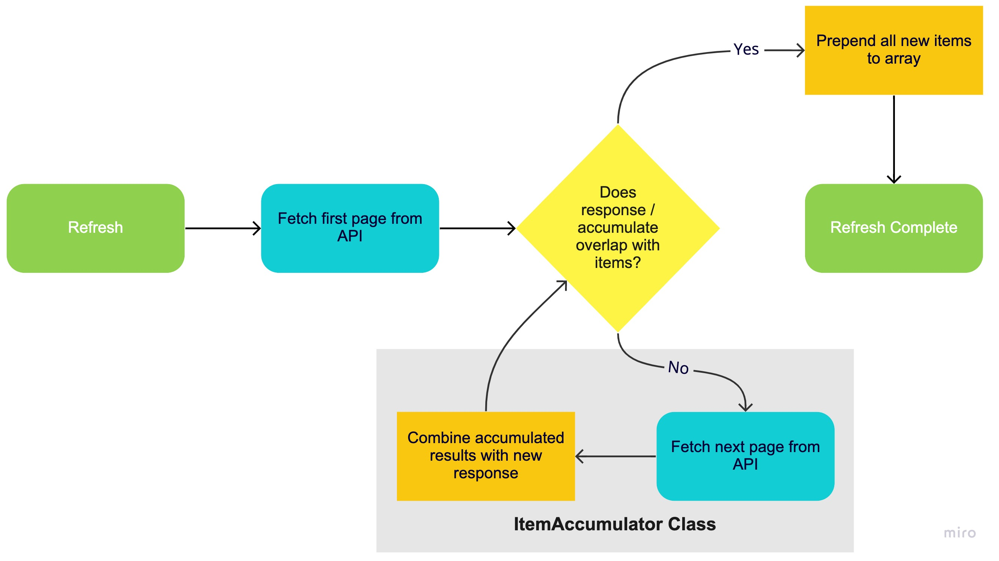
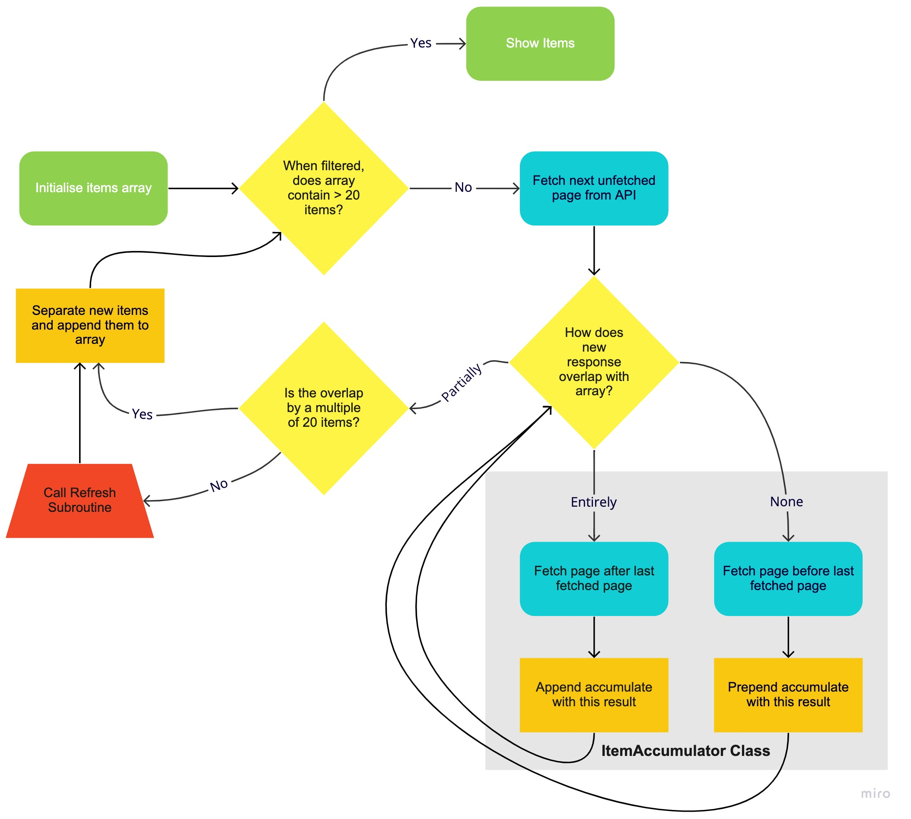

# Better GoGoAnime

This is a chrome extension that aims to improve your experience using the anime streaming website [GoGoAnime](https://gogoanimeapp.com/).

It activates when you go to the main website page and replaces the *Airing Anime* block with a custom component.

## Installation

Anyone can use this extension as the client is hosted online and uses local storage to record user preferences. Therefore only the extension needs to be installed. To do so, follow these steps:

1. Download the source code as a `.zip` from the most recent version
2. Extract it somewhere
3. Go to your chrome extension settings and turn on **Developer mode**
4. Click the **Load unpacked** button and select the `extension/` folder in the source code
5. Now the extension should work when going onto [GoGoAnime](https://gogoanimeapp.com/)

## Documentation

### Architecture

The structure of the application is made up by two parts:

The **Client** is a react app that is hosted on a netlify server. It models the *Airing Anime* section of GoGoAnime by showing a grid layout of the most recently added episodes of shows. It accesses the data and links by calling the GoGoAnime api and then rebuilds the interface with additional features.

The **Extension** is the chrome extension that once downloaded, activates when going to the site and then deletes the section and creates an *iframe* that is linked to the client. It also modifies other areas of the page such as placing buttons, which can communicate with the page in the iframe through [iframe messaging](https://developer.mozilla.org/en-US/docs/Web/API/Window/postMessage).

### API Handling

The **Client** collects the airing anime from the GoGoAnime api which works as a paginated system relative to the most recent item. Therefore, in order to get enough items to fill a screen (after filtering) the client needs to accumulate multiple pages. It also needs to handle when new items are added to the first page during use, as this offsets all items meaning some move pages. To handle the api there are two primary processes:

1. Refreshing to get any new items that have been added

2. Retreiving more items by going through later pages

